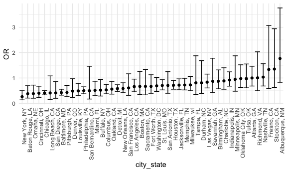
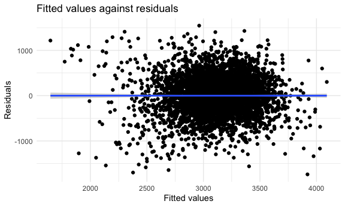
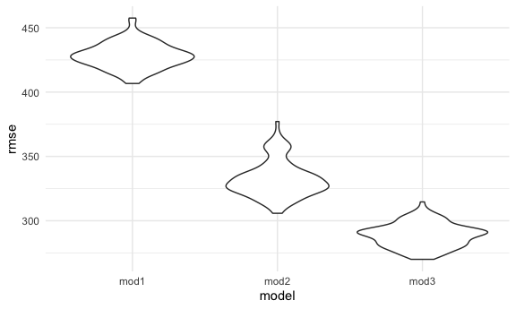
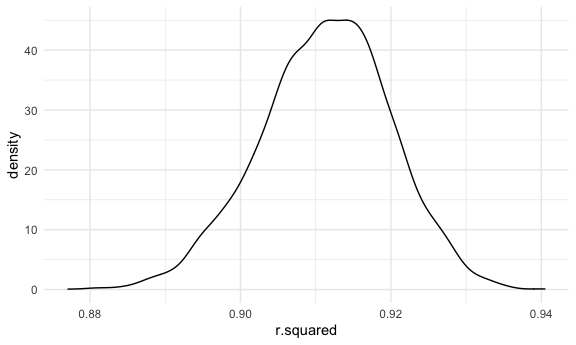
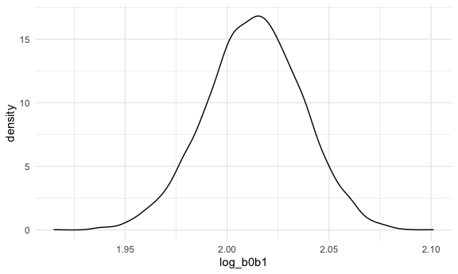

Homework 6
================
Lunbei Hu
2020-12-09

This is my solution to HW6.

## Problem 1

``` r
homicide_df = 
  read_csv("data/homicide-data.csv", na = c("", "NA", "Unknown")) %>% 
  mutate(
    city_state = str_c(city, state, sep = ", "),
    victim_age = as.numeric(victim_age),
    resolution = case_when(
      disposition == "Closed without arrest" ~ 0,
      disposition == "Open/No arrest"        ~ 0,
      disposition == "Closed by arrest"      ~ 1)
  ) %>% 
  filter(
    victim_race %in% c("White", "Black"),
    city_state != "Tulsa, AL") %>% 
  select(city_state, resolution, victim_age, victim_race, victim_sex)
```

    ## Parsed with column specification:
    ## cols(
    ##   uid = col_character(),
    ##   reported_date = col_double(),
    ##   victim_last = col_character(),
    ##   victim_first = col_character(),
    ##   victim_race = col_character(),
    ##   victim_age = col_double(),
    ##   victim_sex = col_character(),
    ##   city = col_character(),
    ##   state = col_character(),
    ##   lat = col_double(),
    ##   lon = col_double(),
    ##   disposition = col_character()
    ## )

Start with one city.

``` r
baltimore_df =
  homicide_df %>% 
  filter(city_state == "Baltimore, MD")
glm(resolution ~ victim_age + victim_race + victim_sex, 
    data = baltimore_df,
    family = binomial()) %>% 
  broom::tidy() %>% 
  mutate(
    OR = exp(estimate),
    CI_lower = exp(estimate - 1.96 * std.error),
    CI_upper = exp(estimate + 1.96 * std.error)
  ) %>% 
  select(term, OR, starts_with("CI")) %>% 
  knitr::kable(digits = 3)
```

| term              |    OR | CI\_lower | CI\_upper |
| :---------------- | ----: | --------: | --------: |
| (Intercept)       | 1.363 |     0.975 |     1.907 |
| victim\_age       | 0.993 |     0.987 |     1.000 |
| victim\_raceWhite | 2.320 |     1.648 |     3.268 |
| victim\_sexMale   | 0.426 |     0.325 |     0.558 |

Try this across cities.

``` r
models_results_df = 
  homicide_df %>% 
  nest(data = -city_state) %>% 
  mutate(
    models = 
      map(.x = data, ~glm(resolution ~ victim_age + victim_race + victim_sex, data = .x, family = binomial())),
    results = map(models, broom::tidy)
  ) %>% 
  select(city_state, results) %>% 
  unnest(results) %>% 
  mutate(
    OR = exp(estimate),
    CI_lower = exp(estimate - 1.96 * std.error),
    CI_upper = exp(estimate + 1.96 * std.error)
  ) %>% 
  select(city_state, term, OR, starts_with("CI")) 
```

``` r
models_results_df %>% 
  filter(term == "victim_sexMale") %>% 
  mutate(city_state = fct_reorder(city_state, OR)) %>% 
  ggplot(aes(x = city_state, y = OR)) + 
  geom_point() + 
  geom_errorbar(aes(ymin = CI_lower, ymax = CI_upper)) + 
  theme(axis.text.x = element_text(angle = 90, hjust = 1))
```



It looks like cities with larger ORs also tends to have wider confidence
interval/more dispersed.

## Problem 2

Import the birthweight data and do some data cleaning. (convert numeric
to factor where appropriate, check for missing data)

``` r
baby_df = 
  read_csv("./data/birthweight.csv") %>% 
  mutate(
    babysex = as.factor(babysex),
    frace = as.factor(frace),
    malform = as.factor(malform),
    mrace = as.factor(mrace)
    ) %>% 
  mutate(
    babysex = recode(babysex, "1" = "Male", "2" = "Female"),
    frace = recode(frace, "1" = "White", "2" = "Black", "3" = "Asian", "4" = "Puerto Rican",
                   "8" = "Other", "9" = "Unknown"),
    malform = recode(malform, "0" = "Absent", "1" = "Present"),
    mrace = recode(mrace, "1" = "White", "2" = "Black", "3" = "Asian", "4" = "Puerto Rican",
                   "8" = "Other")
  )
```

    ## Parsed with column specification:
    ## cols(
    ##   .default = col_double()
    ## )

    ## See spec(...) for full column specifications.

``` r
sum(is.na(baby_df))
```

    ## [1] 0

There is no missing data in the birthweight dataset.

After doing an online research, I hypothesize birthweight is associated
with mother’s weight at delivery, gestational age in weeks, mother’s age
at delivery, mother’s race, average number of cigarettes smoked, so a
model is fitted based on these variables.

``` r
mod1 = lm(bwt ~ delwt + gaweeks + momage + mrace + smoken, data = baby_df)
```

``` r
baby_df %>% 
  add_predictions(mod1) %>% 
  add_residuals(mod1) %>% 
  ggplot(aes(x = pred, y = resid)) + 
  geom_point() +
  geom_smooth(method = "lm") + 
  labs(title = "Fitted values against residuals", 
       x = "Fitted values", 
       y = "Residuals")
```

    ## `geom_smooth()` using formula 'y ~ x'



Compare your model to two others using cross-validated prediction error.

Create a training dataset and a testing dataset.

``` r
cv_df =
  crossv_mc(baby_df, 100) %>% 
  mutate(
    train = map(train, as_tibble),
    test = map(test, as_tibble)
  )
```

Fit my model and the other two models using the training dataset, and
calculate the RMSE using the testing dataset.

``` r
cv_df = 
  cv_df %>% 
  mutate(
    mod1  = map(.x = train, ~lm(bwt ~ delwt + gaweeks + momage + mrace + smoken, 
                                data = .x)),
    mod2  = map(.x = train, ~lm(bwt ~ blength + gaweeks, data = .x)),
    mod3  = map(.x = train, ~lm(bwt ~ bhead*blength*babysex, data = .x))
  ) %>% 
    mutate(
    rmse_mod1 = map2_dbl(.x = mod1, .y = test, ~rmse(model = .x, data = .y)),
    rmse_mod2 = map2_dbl(.x = mod2, .y = test, ~rmse(model = .x, data = .y)),
    rmse_mod3 = map2_dbl(.x = mod3, .y = test, ~rmse(model = .x, data = .y))
    )
```

Violin plots of RMSEs.

``` r
cv_df %>% 
  select(starts_with("rmse")) %>% 
  pivot_longer(
    everything(),
    names_to = "model", 
    values_to = "rmse",
    names_prefix = "rmse_"
  ) %>% 
  ggplot(aes(x = model, y = rmse)) + 
  geom_violin()
```



In terms of the cross-validated prediction error, the best model is the
one using head circumference, length, sex, and all interactions - with
the lowest RMSE.

## Problem 3

Import the 2017 Central Park weather data.

``` r
weather_df = 
  rnoaa::meteo_pull_monitors(
    c("USW00094728"),
    var = c("PRCP", "TMIN", "TMAX"), 
    date_min = "2017-01-01",
    date_max = "2017-12-31") %>%
  mutate(
    name = recode(id, USW00094728 = "CentralPark_NY"),
    tmin = tmin / 10,
    tmax = tmax / 10) %>%
  select(name, id, everything())
```

    ## Registered S3 method overwritten by 'hoardr':
    ##   method           from
    ##   print.cache_info httr

    ## using cached file: /Users/lunbeihu/Library/Caches/R/noaa_ghcnd/USW00094728.dly

    ## date created (size, mb): 2020-10-07 16:39:19 (7.525)

    ## file min/max dates: 1869-01-01 / 2020-10-31

Draw 5000 bootstrap samples and estimate R-square

``` r
weather_boot_results_r =
weather_df %>% 
  bootstrap(5000, id = "strap_number") %>% 
  mutate(
    models = map(.x = strap, ~lm(tmax ~ tmin, data = .x)),
    results = map(models, broom::glance)
  ) %>% 
  select(strap_number, results) %>% 
  unnest(results) %>% 
  select(r.squared)
```

Plot the distribution of estimated R-square

``` r
weather_boot_results_r %>% 
  ggplot(aes(x = r.squared)) +
  geom_density()
```



95% CI for estimated R-square is (0.8936977, 0.9274807).

Estimate log(b0 \* b1)

``` r
weather_boot_results_log =
weather_df %>% 
  bootstrap(5000, id = "strap_number") %>% 
  mutate(
    models = map(.x = strap, ~lm(tmax ~ tmin, data = .x)),
    results = map(models, broom::tidy)
  ) %>% 
  select(strap_number, results) %>% 
  unnest(results) %>% 
  select(strap_number, term, estimate) %>% 
  pivot_wider(
    names_from = term, 
    values_from = estimate
    ) %>% 
  rename(b0 = "(Intercept)", b1 = tmin) %>%
  mutate(log_b0b1 = log(b0*b1)) 
```

Plot the distribution of estimated log(b0 \* b1)

``` r
weather_boot_results_log %>% 
  ggplot(aes(x = log_b0b1)) +
  geom_density()
```



95% CI for log(b0 \* b1) is (1.9656328, 2.0584694).
